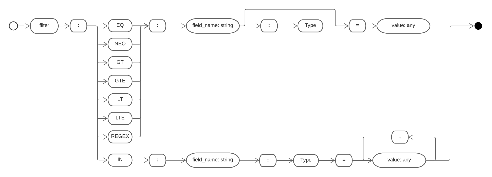
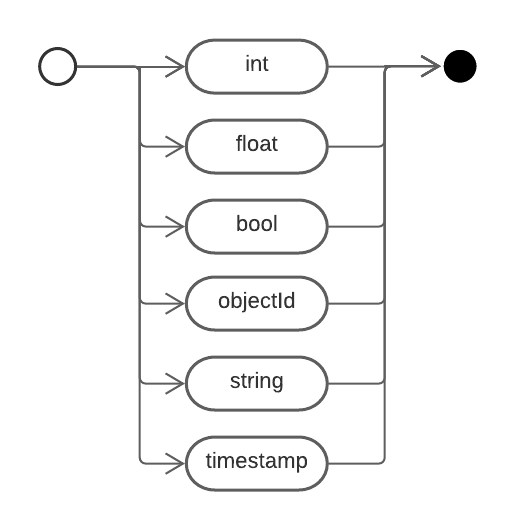

# Spring Mongo Dynamic URL Query

El código contenido en este repositorio permite integrar en una backend Spring-Mongo
integrar querys dinámicas por url

## RailRoad diagrams

### Flujo principal

### Sub-flujo Filtro

### Sub-flujo Type

